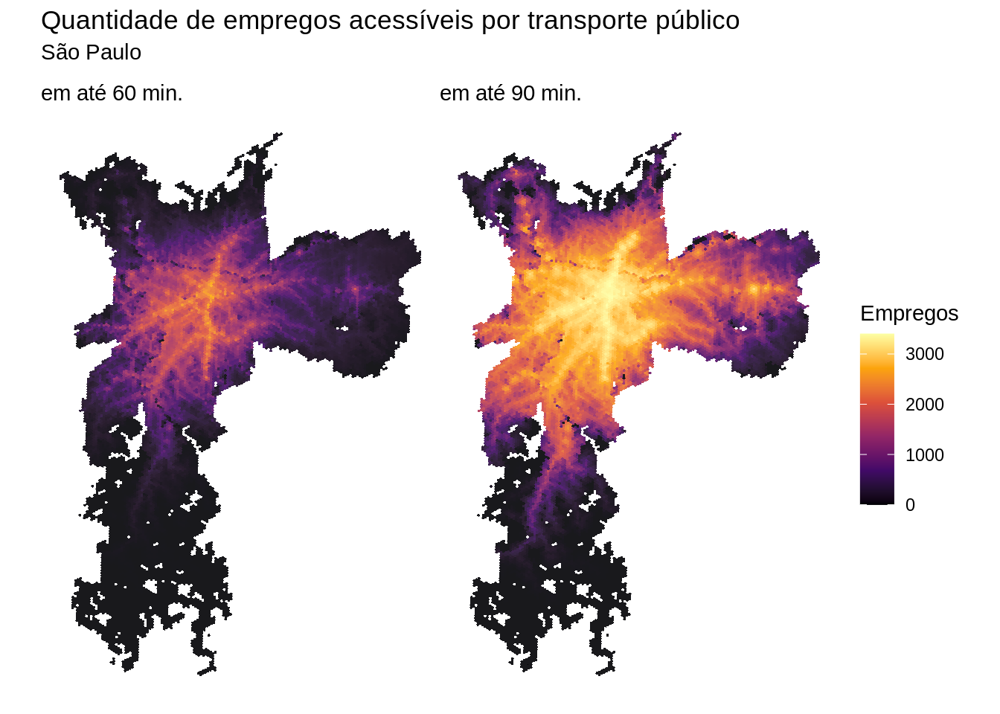

# Estimativas e mapas de acessibilidade

## Download dos dados

Finalmente, o pacote `aopdata` também permite baixar, para todas cidades incluídas no projeto, estimativas anuais de acesso a empregos, serviços saúde, educação e assistência social por modo de transporte

Todos esses dados podem ser baixados com a função `read_access()`, que funciona da mesma maneira que as funções `read_population()` e `read_landuse()` apresentadas nos capítulos anteriores. Aqui, no entanto, além de indicar a cidade (`city`) e o ano (`year`) de referência para baixar os dados, você também precisa informar qual o modo de transporte (`mode`) será baixado e se você quer estimativas de acessibilidade no horário de pico (`peak = TRUE`) ou fora-pico (`peak = TRUE`). Esses dados representam a acessibilidade mediana do período de pico (entre 6h e 8h) e fora-pico (entre 14h e 16h).

Neste exemplo, abaixo, nós mostramos como baixar os dados de uso de acessibilidade urbana no ano de 2019 para São Paulo no período de pico. Nesse exemplo, nós baixamos tanto as estimativas de acessibilidade por automóvel quanto por transporte público, e empilhamos os dados num único `data.frame`.  Note que essa função automaticamente já baixa também os dados de população e de uso do solo, automaticamente.


::: {.cell}

```{.r .cell-code}
library(aopdata)

# download aop accessibility data
df_pt <- read_access(
  city='São Paulo',
  mode='public_transport',
  year=2019,
  peak = TRUE,
  geometry = TRUE,
  showProgress = FALSE
)

df_car <- read_access(
  city='São Paulo',
  mode='car',
  year=2019,
  peak = TRUE,
  geometry = TRUE,
  showProgress = FALSE
)

# row bind into a single data.frame
df <- rbind(df_pt, df_car)
head(df)
```

::: {.cell-output .cell-output-stdout}
```
Simple feature collection with 6 features and 205 fields
Geometry type: POLYGON
Dimension:     XY
Bounding box:  xmin: -46.63863 ymin: -23.71413 xmax: -46.62834 ymax: -23.70485
Geodetic CRS:  WGS 84
           id_hex abbrev_muni name_muni code_muni year P001 P002 P003 P004 P005
1 89a81000003ffff         spo Sao Paulo   3550308 2019  322  127  190    0    5
2 89a81000007ffff         spo Sao Paulo   3550308 2019   16    3   13    0    0
3 89a8100000bffff         spo Sao Paulo   3550308 2019 2386 1142 1232    2   10
4 89a8100000fffff         spo Sao Paulo   3550308 2019  885  260  622    0    3
5 89a81000013ffff         spo Sao Paulo   3550308 2019  725  340  380    0    5
6 89a81000017ffff         spo Sao Paulo   3550308 2019  211  110   98    0    3
  P006 P007 P010 P011 P012 P013 P014 P015 P016  R001 R002 R003 T001 T002 T003
1  158  164   33   63   28   35   85   75    3 477.6    2    3   72   19   50
2    9    7    2    2    2    3    2    5    0  65.7    1    1    0    0    0
3 1216 1170  247  410  174  269  682  572   32 377.2    1    1   52    6   24
4  460  425   96  124   88  127  175  266    9 363.9    1    1    0    0    0
5  371  354   85  129   51   78  196  173   13 503.5    2    3    0    0    0
6  104  107   20   33   16   25   52   59    6 687.9    3    6  113   18   65
  T004 E001 E002 E003 E004 M001 M002 M003 M004 S001 S002 S003 S004 C001
1    3    0    0    0    0    0    0    0    0    0    0    0    0    0
2    0    0    0    0    0    0    0    0    0    0    0    0    0    0
3   22    0    0    0    0    0    0    0    0    0    0    0    0    0
4    0    0    0    0    0    0    0    0    0    0    0    0    0    0
5    0    0    0    0    0    0    0    0    0    0    0    0    0    0
6   30    2    0    2    1 1477    0 1168  309    0    0    0    0    0
              mode peak CMATT15 CMATB15 CMATM15 CMATA15 CMAST15 CMASB15 CMASM15
1 public_transport    1     315      71     175      69       0       0       0
2 public_transport    1     313      70     174      69       0       0       0
3 public_transport    1     229      43     161      25       2       2       2
4 public_transport    1     551     123     343      85       3       3       3
5 public_transport    1     421      90     262      69       2       2       2
6 public_transport    1     312      76     187      49       0       0       0
  CMASA15 CMAET15 CMAEI15 CMAEF15 CMAEM15 CMAMT15 CMAMI15 CMAMF15 CMAMM15
1       0       2       0       2       1    1477       0    1168     309
2       0       2       0       2       1    1477       0    1168     309
3       0       0       0       0       0       0       0       0       0
4       0       4       1       3       2    3132     460    1965     707
5       0       2       0       2       1    1477       0    1168     309
6       0       2       0       2       1    1477       0    1168     309
  CMACT15 CMPPT15 CMPPH15 CMPPM15 CMPPB15 CMPPA15 CMPPI15 CMPPN15 CMPP0005I15
1       0    4895    2428    2467    2238      27       2    2628         505
2       0    4895    2428    2467    2238      27       2    2628         505
3       0    9537    4645    4892    4685      64       3    4785         872
4       0   13109    6331    6778    6453      61       8    6587        1088
5       0    4934    2452    2482    2368      48       0    2518         461
6       0    3199    1608    1591    1567      20       0    1612         317
  CMPP0614I15 CMPP1518I15 CMPP1924I15 CMPP2539I15 CMPP4069I15 CMPP70I15 CMATT30
1         809         371         566        1313        1247        84    4797
2         809         371         566        1313        1247        84    4228
3        1538         726        1138        2550        2539       174    2648
4        2012         967        1575        3383        3783       301    6200
5         749         373         587        1271        1372       121    5773
6         487         239         374         807         891        84    6608
  CMATB30 CMATM30 CMATA30 CMAST30 CMASB30 CMASM30 CMASA30 CMAET30 CMAEI30
1    1293    2789     715       5       5       5       0      18       5
2    1170    2452     606       4       4       4       0      13       4
3     714    1526     408       4       4       4       0       9       2
4    1598    3641     961       5       5       5       0      19       6
5    1589    3271     913       5       5       5       0      18       5
6    1821    3659    1128       6       6       6       0      22       5
  CMAEF30 CMAEM30 CMAMT30 CMAMI30 CMAMF30 CMAMM30 CMACT30 CMPPT30 CMPPH30
1      13       4   15148    2409   10765    1974       1   59041   28457
2       9       3   10497    1949    6931    1617       1   40049   19392
3       7       3    7222    1069    5137    1016       1   59792   28974
4      13       5   15710    2527   10551    2632       2  101380   48709
5      13       4   15148    2409   10765    1974       1   81985   39473
6      17       5   19547    2409   14343    2795       1   83186   40111
  CMPPM30 CMPPB30 CMPPA30 CMPPI30 CMPPN30 CMPP0005I30 CMPP0614I30 CMPP1518I30
1   30584   28535     446      29   30031        5263        8809        4111
2   20657   19159     273      14   20603        3610        6061        2866
3   30818   28424     365      25   30978        5376        9204        4241
4   52671   47601     955      66   52758        9076       15239        6971
5   42512   39784     695      49   41457        7189       12278        5675
6   43075   40359     728      51   42048        7302       12371        5749
  CMPP1924I30 CMPP2539I30 CMPP4069I30 CMPP70I30 CMATT60 CMATB60 CMATM60 CMATA60
1        6817       15664       16733      1644   96195   18711   54773   22711
2        4673       10486       11274      1079   72810   14161   40949   17700
3        6927       15859       16646      1539  147237   26399   82208   38630
4       11658       27259       28303      2874  107938   21292   61768   24878
5        9311       21712       23351      2469  161353   28971   91687   40695
6        9459       22070       23710      2525  158016   28997   91280   37739
  CMAST60 CMASB60 CMASM60 CMASA60 CMAET60 CMAEI60 CMAEF60 CMAEM60 CMAMT60
1      50      38      48       6     120      40      76      29   87761
2      40      34      39       2     108      36      68      28   79902
3      57      45      56       5     135      45      88      30   93958
4      56      43      54       6     128      42      82      31   92799
5      59      44      57       7     141      47      90      32   97925
6      56      43      54       6     139      47      87      32   96281
  CMAMI60 CMAMF60 CMAMM60 CMACT60 CMPPT60 CMPPH60 CMPPM60 CMPPB60 CMPPA60
1   15059   56558   16144       5  547471  259971  287500  277734   11134
2   14014   50455   15433       5  501558  238550  263008  247962    8781
3   16318   61918   15722       6  633994  299454  334540  339064   19838
4   15615   60049   17135       5  689942  325560  364382  378571   21810
5   16744   63838   17343       6  666492  314759  351733  360532   20661
6   16812   62265   17204       6  632529  299225  333304  334655   17957
  CMPPI60 CMPPN60 CMPP0005I60 CMPP0614I60 CMPP1518I60 CMPP1924I60 CMPP2539I60
1     407  258196       44866       76195       34899       59393      146870
2     383  244432       41903       71199       32501       54873      134759
3     473  274619       49586       83666       38585       67298      169669
4     496  289065       53223       89680       41446       72354      184045
5     483  284816       51720       87430       40333       70418      178015
6     451  279466       49804       84545       38888       67458      168928
  CMPP4069I60 CMPP70I60 CMATT90 CMATB90 CMATM90 CMATA90 CMAST90 CMASB90 CMASM90
1      162048     23200 1168463  166686  577124  424653     169     111     160
2      146361     19962 1088120  153982  540566  393572     160     107     152
3      194234     30956 1428750  211239  719220  498291     190     119     179
4      214049     35145 1362473  191461  669950  501062     182     117     172
5      205504     33072 1443193  211449  723001  508743     203     131     191
6      192822     30084 1406215  203383  701014  501818     204     132     193
  CMASA90 CMAET90 CMAEI90 CMAEF90 CMAEM90 CMAMT90 CMAMI90 CMAMF90 CMAMM90
1      42     337     107     207      92  218542   30864  131526   56152
2      39     328     105     201      90  213963   30365  128917   54681
3      50     370     123     222     101  232126   34693  138061   59372
4      46     355     117     214      92  223492   32779  134438   56275
5      51     415     136     248     114  264729   38719  158252   67758
6      51     415     137     247     114  266946   39578  159137   68231
  CMACT90 CMPPT90 CMPPH90 CMPPM90 CMPPB90 CMPPA90 CMPPI90 CMPPN90 CMPP0005I90
1      10 1697502  790958  906544 1113577   80011    1336  502578      111963
2       9 1617428  753988  863440 1054271   74800    1240  487117      107419
3      10 1918445  894649 1023796 1274988   90290    1602  551565      125137
4      10 2096063  978494 1117569 1384576   94542    2065  614880      138110
5      12 2027043  946208 1080835 1333715   91633    1714  599981      133501
6      12 1950319  910888 1039431 1272271   88334    1558  588156      129637
  CMPP0614I90 CMPP1518I90 CMPP1924I90 CMPP2539I90 CMPP4069I90 CMPP70I90
1      183412       87698      165449      454122      573567    121291
2      176240       84154      157827      432825      545306    113657
3      204140       97829      187004      513061      650643    140631
4      225800      107835      205069      561408      707435    150406
5      218843      104726      198411      541774      684520    145268
6      212862      101535      191408      521731      655761    137385
  CMATT120 CMATB120 CMATM120 CMATA120 CMAST120 CMASB120 CMASM120 CMASA120
1  2136716   328724  1094450   713542      357      235      338       82
2  2095040   321900  1068319   704821      355      235      337       80
3  2203072   344047  1136019   723006      374      243      356       86
4  2494268   397258  1308021   788989      418      266      395       97
5  2275396   357833  1177979   739584      401      265      381       90
6  2195795   342423  1130056   723316      387      257      367       88
  CMAET120 CMAEI120 CMAEF120 CMAEM120 CMAMT120 CMAMI120 CMAMF120 CMAMM120
1      821      288      481      221   518042    83000   313683   121359
2      815      288      479      216   516846    83610   313657   119579
3      855      293      508      230   532772    82410   323147   127215
4      976      340      576      260   610890    97742   369803   143345
5      948      333      559      251   600516    97066   367244   136206
6      942      334      554      254   604830    98765   368433   137632
  CMACT120 CMPPT120 CMPPH120 CMPPM120 CMPPB120 CMPPA120 CMPPI120 CMPPN120
1       20  4018897  1890513  2128384  2540395   134426     4039  1340037
2       20  3860887  1814742  2046145  2445536   130803     3868  1280680
3       21  4320562  2032079  2288483  2745882   142238     4320  1428122
4       24  4752649  2234731  2517918  3037441   153875     5098  1556235
5       22  4351102  2049261  2301841  2735091   140022     4377  1471612
6       21  4191716  1974700  2217016  2627575   136196     4172  1423773
  CMPP0005I120 CMPP0614I120 CMPP1518I120 CMPP1924I120 CMPP2539I120 CMPP4069I120
1       281477       467671       217602       408477      1084792      1300130
2       269676       448086       208699       391944      1041317      1251187
3       301337       501274       233530       439651      1163931      1400822
4       330744       549438       256378       484187      1277780      1541189
5       307070       511736       237911       444278      1173140      1401287
6       297029       494835       229726       427661      1129908      1348228
  CMPP70I120 TMIST TMISB TMISM TMISA TMIET TMIEI TMIEF TMIEM TMICT
1     258748    17    17    17    53   8.0    26   8.0   8.0    21
2     249978    21    21    21    55   9.0    28   9.0   9.0    23
3     280017    13    13    13    50  17.0    26  17.0  17.0    30
4     312933    13    13    13    53   7.0    13   7.0   7.0    28
5     275680    12    12    12    51   8.0    24   8.0   8.0    19
6     264329    16    16    16    49   5.8    22   5.8   5.8    16
                        geometry
1 POLYGON ((-46.63251 -23.711...
2 POLYGON ((-46.63552 -23.709...
3 POLYGON ((-46.62941 -23.709...
4 POLYGON ((-46.63242 -23.708...
5 POLYGON ((-46.6326 -23.7141...
6 POLYGON ((-46.63561 -23.712...
```
:::
:::


Os nomes das variáveis (colunas) com estimativas de acessibilidade também estão organizadas com códigos, como `CMAEF30`, `TMISB` ou `CMPPM60`. O nome das colunas com estimativas de acessibilidade são a junção de três componentes: 1) Tipo de indicador de acessibilidade 2) Tipo de oportunidade / pessoas 3) Tempo limite

1) O **tipo de indicador** de acessibilidade é indicado pelas primeiras 3 letras. O projeto AOP atualmente inclui três tipos de indicadores:
  - `CMA`	Indicador de acessibilidade cumulativo ativo
  - `CMP`	Indicador de acessibilidade cumulativo passivo	
  - `TMI`	Indicador de tempo mínimo até oportunidade mais próxima


2) O **tipo de atividade** é indicado pelas letras seguintes, no meio do nome da variável. O projeto AOP atualmente inclui diversos tipos de atividades:
  - `TT` Todos empregos
  - `TB` Empregos de baixa escolaridade
  - `TM` Empregos de média escolaridade
  - `TA` Empregos de alta escolaridade
  - `ST` Todos estabelecimentos de saúde
  - `SB` Estabelecimentos de saúde de baixa complexidade
  - `SM` Estabelecimentos de saúde de média complexidade
  - `SA` Estabelecimentos de saúde de alta complexidade
  - ... e assim por diante.

No caso do indicador de acessibilidade passiva (`CMP`), as letras do meio do nome da variável indicam qual o grupo populacional de referência.

  - `PT` População total
  - `PH` População de homens
  - `PM` População de mulheres
  - `PB` População branca
  - `PN` População negra
  - `P1924I` População de 19 a 24 anos de idade
  - `P2539I` População de 25 a 39 anos de idade

3) O **tempo limite de viagem** é indicado pelos números no final do nome da variável. Esses números somente se aplicam para os indicadores de acessibildade cumulativa ativa (`CMA`) e passiva (`CMP`).

**Exemplos:**
<ul>
  <li> <span style="color: red;">CMA</span><span style="color: black;">EF</span><span style="color: blue;">30</span>: Número de escolas de ensino fundamental acessíveis em até 30 minutos</li>
  <li> <span style="color: red;">TMI</span><span style="color: black;">SB</span>: Tempo de viagem até o estabelecimento de saúde mais próximo com serviços de baixa complexidade</li>
  <li> <span style="color: red;">CMP</span><span style="color: black;">PM</span><span style="color: blue;">60</span>: Quantidade de mulheres que conseguem acessar determinado hexágono em até 60 minutos</li>
</ul>

Lembre-se, a [descrição completa do dicionário de variáveis está disponível no site to pacote aopdata](https://ipeagit.github.io/aopdata/articles/data_dic_pt.html).


A seguir, nós mostramos alguns exemplos de como visualizar essas estimativas de acessibilidade.


## Mapa do tempo para acessar o hospital mais próximo


Neste exemplo, nós vamos comparar o nível de acessibilidade até hospitais entre modos automóvel *vs* transporte público. Para analisar qual o tempo mínimo de viagem (`TMI`) até um hospital de alta complexidade (`SA`), nós precisamos analisar a variável `TMISA`. Com o código abaixo, nós carregamos as bibliotecas para manipulação e visualização de dados, e visualizamos a distribuição espacial dos valores de `TMISA` para ambos modos de transporte.

Note, no entanto, que os tempos de viagem por transporte público costumam ser muito mais longos do que por automóvel. Então para facilitar a visualização dos resultados, nós truncamos  a distribuição dos valores de `TMISA` em 60 minutos ou mais.


::: {.cell}

```{.r .cell-code}
# load libraries
library(ggplot2)
library(data.table)
library(patchwork)
library(scales)
library(sf)


# truncate max values to 60 min.
df$TMISA <- ifelse(df$TMISA > 60, 60, df$TMISA) 

# plot
ggplot() +
  geom_sf(data=subset(df, !is.na(mode)), aes(fill=TMISA), color=NA, alpha=.9) +
  scale_fill_viridis_c(option = 'cividis', direction = -1,
                       breaks = seq(0,60,10),
                       labels = c(seq(0,50,10), "60+")) +
  labs(title='Tempo de viagem até hospital de alta complex. mais próximo', 
       subtitle = 'São Paulo', fill="Tempo em\nminutos") +
  facet_grid(.~mode) +
  theme_void()
```

::: {.cell-output-display}
{width=672}
:::
:::


## Mapa da quantidade de oportunidades acessíveis

Uma vez que os dados já foram baixados do `aopdata`, é muito simples comparar por exemplo a quantidade de oportunidades acessíveis em diferentes tempos de viagem. O código abaixo ilustra como visualizar num mapa o número de empregos acessíveis em até 60 e 90 minutos de viagem por transporte público, e como colocar esses mapas lado a lado para comparação.


::: {.cell}

```{.r .cell-code}
# limits for legend scale
value_limits <- c(0, max(df_pt$CMATT90, na.rm=T)/1000)

# create maps
fig60 <- ggplot() +
          geom_sf(data=subset(df_pt, !is.na(mode)), aes(fill=CMATT60/1000), color=NA, alpha=.9) +
          scale_fill_viridis_c(option = 'inferno', limits = value_limits) +
          labs(subtitle = 'em até 60 min.', fill="Empregos") +
          theme_void()

fig90 <- ggplot() +
          geom_sf(data=subset(df_pt, !is.na(mode)), aes(fill=CMATT90/1000), color=NA, alpha=.9) +
          scale_fill_viridis_c(option = 'inferno', limits = value_limits) +
          labs(subtitle = 'em até 90 min.', fill="Empregos") +
          theme_void()

# plot figure
fig60 + fig90 + 
  plot_layout(guides = 'collect') +
  plot_annotation(title = 'Quantidade de empregos acessíveis por transporte público',
                  subtitle = "São Paulo")
```

::: {.cell-output-display}
{width=672}
:::
:::


## Desigualdades de acesso a oportunidades

Existem diversas maneiras de se analisar quão desiguais são as condições de acesso a oportunidades a partir dos dados do `aopdata`. Nós apresentamos nesta subseção três exemplos de como esse tipo de análise pode ser realizada.

**Desigualdade no tempo de acesso `TMI`**

Neste primeiro exemplo, nós vamos comparar qual o tempo médio de viagem até o hospital mais próximo para pessoas de diferentes níveis de renda. Para isso, o código abaixo calcula o valor médio de `TMISA` ponderada pela população em cada hexágono. Essa ponderação é necessária porque o número de hexágonos pode variar muito entre hexágonos.

Antes disso, cabe observar que alguns hexágonos da cidade não conseguem acessar nenhum hospital em até 2h de viagem. Em casos como esse, o valor das variáveis `TMI__` é infinito (`Inf`). Para lidar com esses casos, nós substituímos abaixo todos valores `Inf` por 120 minutos.


::: {.cell}

```{.r .cell-code}
# copy data to new data.table
dt <- copy(df_pt)
setDT(dt)

# replace Inf travel time with 120
dt[, TMISA := fifelse(TMISA==Inf, 120, TMISA)]

# calculate average travel time by income
temp <- dt[, .(average = weighted.mean(x=TMISA, w=P001, na.rm=T)), by=R003]
temp <- na.omit(temp)

ggplot() + 
  geom_col(data=temp, aes(y=average, x=factor(R003)), fill='#2c9e9e', color=NA) +
  scale_x_discrete(labels=c("D1\n+Pobres", paste0('D', 2:9), "D10\n+Ricos")) +
  labs(title = 'Média de tempo de viagem até o hospital mais proximo',
       subtitle = 'por transporte público em São Paulo',
       x='Decil de renda', y='Tempo de viagem\nem min.') +
  theme_minimal()
```

::: {.cell-output-display}
{width=672}
:::
:::


**Desigualdade do número de oportunidades acessíveis `CMA`**

Outra maneira de examinar a desigualdade de acesso a oportunidades é comparar a quantidade de oportunidades acessíveis por diferentes grupos populacionais considerando-se um mesmo modo de transporte e tempo de viagem. Nesse caso, nós analisamos o Indicador de acessibilidade cumulativo ativo (`CMA`).

Neste exemplo abaixo, nós utilizamos *box plots* para comparar a quantidade de empregos acessíveis por transporte público em até 30 minutos de viagem.


::: {.cell}

```{.r .cell-code}
ggplot() +
  geom_boxplot(data=subset(dt, !is.na(R003)),
               aes(x = factor(R003), y=CMATT60/1000, color=factor(R003))) +
  scale_color_brewer(palette = 'RdBu') +
  labs(title='Distribução do número de empregos acessíveis em até 30 min.', color="Decil\nde renda",
       subtitle='por transporte público, São Paulo',
       x='Decil de renda', y="N. de empregos acessíveis\n(em milhares)") +
  scale_x_discrete(labels=c("D1\n+Pobres", paste0('D', 2:9), "D10\n+Ricos")) +
  theme_minimal()
```

::: {.cell-output-display}
{width=672}
:::
:::


Também é possível comparar como diferentes modos de transporte possibilitam diferentes níveis de acessibilidade, e como essa diferença pode variar muito entre cidades. Nesse exemplo, abaixo, nós vamos comparar a quantidade de empregos acessíveis em até 30 minutos de viagem a pé e de carro. O primeiro passo é baixar os dados de acessibilidade a pé e por automóvel para todas as cidades.


::: {.cell}

```{.r .cell-code}
# download data
df_car <- read_access(city = 'all', mode='car', year = 2019, showProgress = FALSE)
df_walk <- read_access(city = 'all', mode='walk', year = 2019, showProgress = FALSE)
```
:::


O próximo passo é calcular para cada cidade a média ponderada do número de empregos acessíveis em até 30 minutos (`CMATT30`) para cada um dos modos de transporte. Com esses resultados prontos para cada modo, nós juntamos essas estimativas num único `data.frame` e calculamos a razão da acessibilidade por carro dividida pela acessibilidade à pé.


::: {.cell}

```{.r .cell-code}
# calculate the average number of jobs accessible in 30min
df_car2 <- df_car[, .(access_car = weighted.mean(CMATT30, w = P001, na.rm=T)), by=name_muni]
df_walk2 <- df_walk[, .(access_walk = weighted.mean(CMATT30, w = P001, na.rm=T)), by=name_muni]

# merge and get the ratio between walking and driving access
df <- merge(df_car2, df_walk2)
df[, ratio := access_car/access_walk]

head(df)
```

::: {.cell-output .cell-output-stdout}
```
        name_muni access_car access_walk    ratio
1:          Belem   155270.4    9392.235 16.53179
2: Belo Horizonte   529890.0   12464.233 42.51284
3:       Brasilia   220575.9    4110.703 53.65892
4:       Campinas   256333.1    6748.923 37.98133
5:   Campo Grande   172680.5    4181.209 41.29919
6:       Curitiba   494376.9   10471.135 47.21331
```
:::
:::


Pronto, agora é só visualizar os resultados. Como esperado, a figura abaixo mostra que é possível acessar muito mais empregos em 30 min. por automóvel do que em caminhada. No entanto, essa diferença varia muito entre cidades. Em São Paulo e em Brasília, 30 minutos de viagem por automóvel permite acessar, em média, um número de empregos 54 vezes maior do que a pé. Em Belém, onde observamos a menor diferença, o automóvel ainda permite acessar 17 vezes mais empregos do que a caminhada.


::: {.cell}

```{.r .cell-code}
# plot
ggplot(data=df, aes(x=ratio, y=reorder(name_muni, ratio))) +
  geom_bar(stat='identity') +
  geom_text(aes(x=ratio+6 , label=paste0(round(ratio),'x'))) +
  labs(title = 'Diferença da quantidade de empregos acessiveis por\nautomóvel vs a pé',
       subtitle= 'em até 30 min. de viagem',
       y='', x='Número de vezes') +
  theme_classic() 
```

::: {.cell-output-display}
{width=672}
:::
:::

