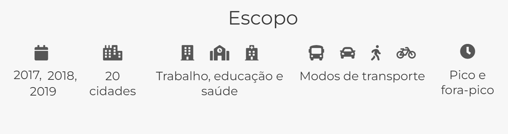
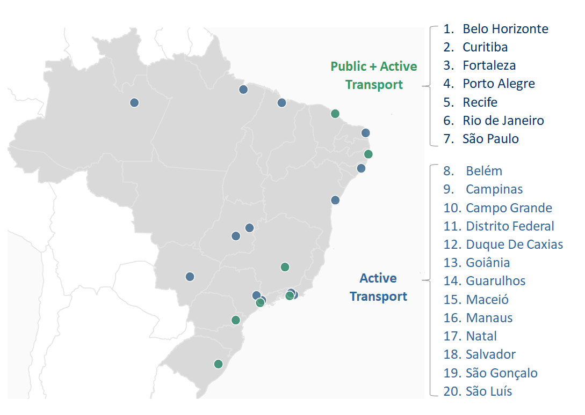

# PARTE 2: Dados do Projeto AOP {#sec-dados_aop}

**Objetivo**: o objetivo deste capítulo é mostrar como fazer download e analisar os dados do projeto Acesso a Oportunidades (AOP) utilizando o pacote `aopdata` no `R`.

Nos capítulos mais adiante, você irá aprender a como calcular indicadores de acessibilidade. No entanto, em muitos casos, você não tem disponibilidade para calcular esses indicadores por conta própria e tudo o que você quer é analisar os resultados que já foram calculados por alguém. 


O projeto [Acesso a Oportunidades](https://www.ipea.gov.br/acessooportunidades/) disponibiliza uma extensa base de dados com informações sobre a distribuição da população, atividades econômicas e serviços públicos, além de várias estimativas de acessibilidade urbana para diversos tipos de atividades. Essas estimativas de acessibilidade estão disponíveis para diferentes modos de transporte (caminhada, bicicleta, transporte público e automóvel), horários do dia (pico e fora-pico), grupos populacionais (segundo níveis de renda, cor, sexo e idade) e para diferentes atividades (empregos, escolas, serviços de saúde e centros de assistência social). Nesta versão, a base de dados traz essas informações para diversos anos (2017, 2018 e 2019), se apoiando em uma única metodologia consistente para as 20 maiores cidades do Brasil. Veja abaixo @tbl-tabela_dados_pop e @tbl-tabela_dados_access.

::: {.callout-note appearance="simple"}
As metodologias utilizadas para gerar estes dados são apresentadas em detalhe em publicações separadas, para os dados populacionais e de uso do solo [@pereira2022usosolo], e para os dados de acessibilidade [@pereira2022acessibilidade].
:::

# Quais dados estão disponíveis?

### Escopo dos dados:






## Dados de população, empregos e serviços públicos:

Tabela x. Informações socioeconômicas da população e de distribuição espacial de atividades, segundo ano e fonte de dados.

::: {.cell}
::: {.cell-output-display}
`````{=html}
<table>
 <thead>
  <tr>
   <th style="text-align:left;"> Dado </th>
   <th style="text-align:left;"> Informações </th>
   <th style="text-align:left;"> Anos </th>
   <th style="text-align:left;"> Fonte </th>
  </tr>
 </thead>
<tbody>
  <tr>
   <td style="text-align:left;"> Características sociodemográficas da população </td>
   <td style="text-align:left;"> Quantidade de pessoas segundo sexo, faixa de idade e cor/raça; média da renda domiciliar per capita </td>
   <td style="text-align:left;"> 2010 </td>
   <td style="text-align:left;"> Censo Demográfico, IBGE </td>
  </tr>
  <tr>
   <td style="text-align:left;"> Estabelecimentos de educação </td>
   <td style="text-align:left;"> Quantidade de creches e escolas públicas segundo nível infantil, fundamental e médio </td>
   <td style="text-align:left;"> 2017, 2018, 2019 </td>
   <td style="text-align:left;"> Censo Escolar, Inep </td>
  </tr>
  <tr>
   <td style="text-align:left;"> Estabelecimentos de saúde </td>
   <td style="text-align:left;"> Quantidade de estabelecimentos de saúde que atendem pelo SUS segundo nível de atenção baixa, média e alta complexidade </td>
   <td style="text-align:left;"> 2017, 2018, 2019 </td>
   <td style="text-align:left;"> Cadastro Nacional de Estabelecimentos de Saúde (CNES), Ministério da Saúde </td>
  </tr>
  <tr>
   <td style="text-align:left;"> Atividade econômica </td>
   <td style="text-align:left;"> Quantidade de empregos formais conforme o nível de instrução dos trabalhadores baixa, média e alta escolaridade </td>
   <td style="text-align:left;"> 2017, 2018, 2019 </td>
   <td style="text-align:left;"> Relação Anual de Informações Sociais (RAIS), Ministério da Economia </td>
  </tr>
  <tr>
   <td style="text-align:left;"> Estabelecimentos de assistência social </td>
   <td style="text-align:left;"> Quantidade de CRAS </td>
   <td style="text-align:left;"> 2017, 2018, 2019 </td>
   <td style="text-align:left;"> Censo SUAS, Ministério da Cidadania </td>
  </tr>
</tbody>
</table>

`````
:::
:::


: Informações socioeconômicas da população e de distribuição espacial de atividades, segundo ano e fonte de dados {#tbl-tabela_dados_pop}


## Dados de acessibilidade urbana:


::: {.cell}
::: {.cell-output-display}
`````{=html}
<table>
 <thead>
  <tr>
   <th style="text-align:left;"> Indicador (código) </th>
   <th style="text-align:left;"> Descrição </th>
   <th style="text-align:left;"> Tipo de oportunidades </th>
   <th style="text-align:left;"> Limites de tempo de viagem </th>
  </tr>
 </thead>
<tbody>
  <tr>
   <td style="text-align:left;"> Tempo mínimo de viagem (TMI) </td>
   <td style="text-align:left;"> Tempo até a oportunidade mais próxima </td>
   <td style="text-align:left;"> Saúde, Educação, CRAS </td>
   <td style="text-align:left;"> A pé (60 mins)
Bicicleta, Transporte público e carro (120 mins) </td>
  </tr>
  <tr>
   <td style="text-align:left;"> Medida cumulativa ativa (CMA) </td>
   <td style="text-align:left;"> Quantidade de oportunidades acessíveis em um determinado limite de tempo </td>
   <td style="text-align:left;"> Trabalho, Saúde, Educação, CRAS </td>
   <td style="text-align:left;"> A pé e bicicleta (15, 30, 45 e 60 mins)
Transporte público e carro (15, 30, 60, 90 e 120 mins) </td>
  </tr>
  <tr>
   <td style="text-align:left;"> Medida cumulativa passiva (CMP) </td>
   <td style="text-align:left;"> Quantidade de pessoas que acessam a localidade em um determinado limite de tempo </td>
   <td style="text-align:left;"> - </td>
   <td style="text-align:left;"> A pé e bicicleta (15, 30, 45 e 60 mins)
Transporte público e carro (15, 30, 60, 90 e 120 mins) </td>
  </tr>
</tbody>
</table>

`````
:::
:::

: Indicadores de acessibilidade calculados no Projeto Acesso a Oportunidades {#tbl-tabela_dados_access}

Todas as bases de dados criadas pelo Projeto Acesso a Oportunidades (AOP) estão disponíveis para download no [site do projeto](https://www.ipea.gov.br/acessooportunidades/dados/) ou pelo pacote de R aopdata. Nas próximas seções são apresentados exemplos de como baixar e visualizar esses dados em `R`.


